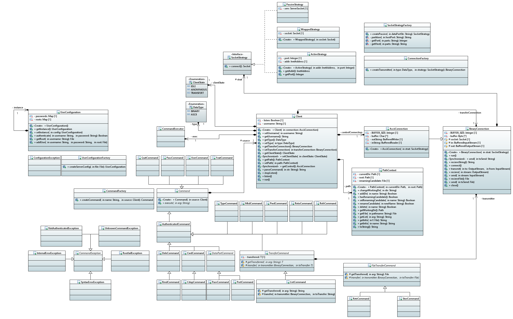

# FTP Server

### Auteur : Enzo Pain

### Date : 15/02/22

## Introduction

Projet de serveur FTP selon la [RFC959](https://datatracker.ietf.org/doc/html/rfc959).

## Utilisation

### Compilation

Pour générer le JAR du serveur ainsi qu'une racine et configuration d'exemple :

	mvn package
	
Pour la javadoc utilisez la commande suivante :

	mvn javadoc:javadoc
	
Elle sera ensuite disponible ici : target/site/apidocs/index.html

### Exécution

Le serveur s'exécute dans un terminal suivant la syntaxe :

	java -jar target/ftpserver-1.0.jar PORT USER_CONF
	
Par exemple, après un `mvn package` une racine et une configuration d'exemple peuvent être utilisées ainsi :

	java -jar target/ftpserver-1.0.jar 2121 target/classes/users.conf
	
### Configuration

Le fichier de configuration donné en paramètre permet de spécifier les utilisateurs du serveur ainsi que leur mot de passe et leur racine.  
Le fichier contient un utilisateur par ligne selon le format :

	nom_d'utilisateur   mot_de_passe   racine
	
## Architecture

Le projet est principalement développé autour du design pattern Command.  
Ces commandes sont réparties dans trois paquetages différents comme le fait la RFC.  

- `pain.ftpserver.ftp.command.access` : Pour tout ce qui est gestion d'accès au serveur.
- `pain.ftpserver.ftp.command.params` : Qui permet de paramétrer le transfert des données.
- `pain.ftpserver.ftp.command.service` : Pour les commandes de services dont celle de transfert.
  
Les Data Connections sont créées par une Factory (`ConnectionFactory`) selon le type de donnée à échanger (ASCII ou BINAIRE).  
Elles encapsulent une `SocketStrategy` qui leurs permet de récupérer la Socket utile aux échange de différentes façon (Mode actif, Mode passif).

Une classe `Client` permet d'exécuter la boucle principale de traitement et de centraliser les informations courantes d'un client :

- La control connection : `AsciiConnection`
- La data connection courante : `BinaryConnection`
- L'état du client : `ClientState`
- Le type de donnée à échanger : `DataType`
- Le contexte dans le système de fichier : `PathContext`

Le contexte  dans le système de fichier réalise toutes les actions sur le système de fichier selon le repértoire courant et la racine d'un client.  
C'est aussi ce contexte d'où sont tirés les informations de LIST et PWD par exemple.

Les erreurs internes (erreurs de transfert ...)  et les actions non autorisée génèrent des Exception récupérées par le Client.  
Cela permet de centraliser l'envoie de réponses communes à toutes les commandes commes les erreurs 501, 530, 550.  
Ces Exception sont appelées `CommandException` et peuvent être throw par les `execute` de chaque commande.

## Code Samples

Code générique des commandes PASV et PORT :

	@Override
	public void execute(String arg) throws CommandException, IOException {
		super.execute(arg);
		BinaryConnection transmitter = ConnectionFactory.createTransmitter(source.getType(), getStrategy(arg));
		source.setTransferConnection(transmitter);
		transmitter.start();
		source.getControl().send(getResponse());
		source.setClientState(ClientState.TRANSFERT);
	}
	
	protected abstract String getResponse();
	protected abstract SocketStrategy getStrategy(String arg) throws IOException;
	
PASV et PORT n'ont plus qu'a implémenter deux petites fonctions, voici celles de PORT :

	@Override
	protected SocketStrategy getStrategy(String arg) throws UnknownHostException {
		return SocketStrategyFactory.createActive(arg);
	}

	@Override
	protected String getResponse() {
		return "200 PORT Successful";
	}

Et de PASV :

	@Override
	protected SocketStrategy getStrategy(String arg) throws IOException {
		strat = new PassiveStrategy();
		return strat;
	}

	@Override
	protected String getResponse() {
		return "227 Entering Passive Mode " + strat + '.';
	}
	
----

Sur le même principe les commandes de transfert (LIST, RETR, STOR) partagent un code générique :

	@Override
	public void execute(String arg) throws CommandException, IOException {
		super.execute(arg);
		if (source.getClientState() == ClientState.TRANSFERT) {
			try {
				transferred = getTransferred(arg);
				transmitter = source.getTransferConnection();
				Thread t = new Thread(this);
				source.setCurrentTransfer(t);
				t.start();
			} catch (FileNotFoundException e) {
				source.getControl().send("550 Requested action not taken.");
			}
		}
		else {
			source.getControl().send("425 Use PORT or PASV first.");
		}
	}
	
	protected abstract T getTransferred (String arg) throws IOException;
	protected abstract void transfer(BinaryConnection transmitter, T toTransfer) throws IOException;
	
Ce qui donne pour LIST :

	@Override
	protected String getTransferred(String arg) throws IOException {
		return source.getPath().getList(arg);
	}

	@Override
	protected void transfer(BinaryConnection transmitter, String toTransfer) throws IOException {
		transmitter.send(toTransfer);
	}
	
Pour STOR :

	@Override
	protected void transfer(BinaryConnection transmitter, File file) throws IOException {
		File f = transmitter.recieveFile();
		Files.move(f.toPath(), file.toPath());
	}
	@Override
	protected File getTransferred(String arg) throws IOException {
		return source.getPath().getFile(arg);
	}
	
Et pour RETR :

	@Override
	protected void transfer(BinaryConnection transmitter, File file) throws IOException {
		transmitter.send(file);
	}
	@Override
	protected File getTransferred(String arg) throws IOException {
		return source.getPath().getFile(arg);
	}